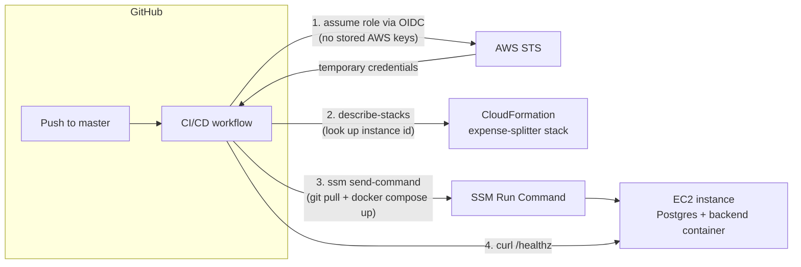

# Deployment architecture

How Expense Splitter gets from a `git push` to running on AWS. For the
day-to-day process (what triggers what, rollbacks, approvals), see
[`release-process.md`](release-process.md). For the infrastructure
templates and their exact deploy commands, see
[`infra/cloudformation/README.md`](../infra/cloudformation/README.md).

## Two separate concerns, deliberately

1. **Infrastructure provisioning** — the EC2 instance, its security group,
   Elastic IP, and IAM role. Created *once*, manually, via
   `infra/cloudformation/ec2-stack.yaml` (see
   `infra/cloudformation/README.md`). CI/CD does not create or modify
   this.
2. **Application deployment** — pushing new app code to that
   already-running instance. This is what CI/CD does, on every push to
   `master`.

They're split because CloudFormation's `UserData` (the script that
installs Docker and starts the app) only runs once, on the instance's
first boot — there's no built-in way to make a stack update re-run it
without replacing the instance. Splitting the concerns means a code change
doesn't need CI to touch live infrastructure to redeploy — it just SSMs the
running instance.

## Architecture



## Components

| Piece | File | Created |
| --- | --- | --- |
| App instance, security group, Elastic IP, instance IAM role | `infra/cloudformation/ec2-stack.yaml` | Once, manually (see its README) |
| GitHub OIDC provider + deploy role | `infra/cloudformation/github-oidc-role.yaml` | Once, manually (below) |
| CI/CD pipeline | `.github/workflows/ci-cd.yml` | Runs on every push/PR |

## Why OIDC instead of stored AWS keys

The deploy job authenticates to AWS via
[`aws-actions/configure-aws-credentials`](https://github.com/aws-actions/configure-aws-credentials)
requesting a short-lived token from GitHub's own OIDC provider
(`token.actions.githubusercontent.com`), which it exchanges for temporary
AWS credentials via `sts:AssumeRoleWithWebIdentity`. No AWS access key or
secret key is ever stored in GitHub — only a role ARN (not a secret in
itself; the trust policy is what actually gates access).

The role's trust policy (`github-oidc-role.yaml`) only allows this: a
token whose `sub` claim is exactly
`repo:<org>/<repo>:ref:refs/heads/master` — i.e. only a workflow run
triggered by this specific repo, on the `master` branch, can assume it. A
PR from a fork, a different repo, or a different branch cannot.

The role's permissions are scoped narrowly to what the deploy step
actually does:
- `ssm:SendCommand` — only on the specific EC2 instance (matched by its
  `Name` tag) and only using the `AWS-RunShellScript` document.
- `ssm:GetCommandInvocation` / `ssm:ListCommandInvocations` — to read the
  command's result (these SSM actions don't support resource-level
  scoping, so this is `*`, but it's read-only).
- `cloudformation:DescribeStacks` — only on the `expense-splitter` stack.
- `ec2:DescribeInstances` — read-only, needed to resolve the instance
  before targeting it.

It cannot launch, stop, or terminate instances, change the security
group, modify IAM, or touch any other stack.

## Why SSM Run Command instead of SSH

No SSH key material needs to exist in GitHub at all, and no inbound port
needs to be opened for CI runners (which don't have stable IPs, unlike a
human's laptop). The EC2 instance's own IAM role
(`AppInstanceRole` in `ec2-stack.yaml`) has the AWS-managed
`AmazonSSMManagedInstanceCore` policy, which is what lets it receive
commands from SSM in the first place — this is the one change
`ec2-stack.yaml` needed to support CI/CD deploys (see its `Description`
field: it now requires `--capabilities CAPABILITY_IAM` to deploy/update).

## One-time setup

Do this once, before the pipeline's `deploy` job can work (the
`backend-tests`/`frontend-tests`/`integration-and-e2e` jobs need nothing
AWS-specific and will run regardless).

1. **The app stack must already exist** — if you haven't, see
   `infra/cloudformation/README.md` first for the initial deploy. If it
   already exists from before this IAM role was added, update it (adds
   the IAM instance role needed for SSM):
   ```bash
   aws cloudformation deploy \
     --template-file infra/cloudformation/ec2-stack.yaml \
     --stack-name expense-splitter \
     --parameter-overrides VpcId=... SubnetId=... KeyPairName=... SSHLocationCidr=... \
     --capabilities CAPABILITY_IAM
   ```
   (Same parameters as before, plus the new `--capabilities` flag.
   Attaching an IAM instance profile to a running instance takes effect
   within a few minutes — no reboot needed.)

2. **Create the GitHub OIDC deploy role:**
   ```bash
   aws cloudformation deploy \
     --template-file infra/cloudformation/github-oidc-role.yaml \
     --stack-name expense-splitter-github-oidc \
     --parameter-overrides \
         GitHubOrg=<your-github-org-or-username> \
         GitHubRepo=<repo-name> \
     --capabilities CAPABILITY_IAM
   ```
   If your AWS account already has a GitHub OIDC provider registered
   (from another project — an account can only have one per URL), add
   `CreateOidcProvider=false` to reuse it instead of failing on a
   duplicate.

3. **Get the role ARN and store it as a GitHub secret:**
   ```bash
   aws cloudformation describe-stacks --stack-name expense-splitter-github-oidc \
     --query 'Stacks[0].Outputs[0].OutputValue' --output text
   ```
   In the GitHub repo: **Settings → Environments → New environment**
   named `production` → add environment secret `AWS_DEPLOY_ROLE_ARN` with
   that value. (An environment secret, not a repo secret, because the
   workflow's `deploy` job specifies `environment: production` — this also
   lets you add required reviewers on that environment later; see
   `release-process.md`.)

4. Push to `master`. The next run's `deploy` job should succeed.

## What this does not do

- **No zero-downtime deploys.** `docker compose up -d --build` recreates
  the backend container in place; there's a brief gap while it restarts.
  Fine for a single-instance practice deployment, not for anything with
  real uptime requirements.
- **No automatic rollback.** A bad deploy has to be fixed forward (revert
  and push) or rolled back manually — see `release-process.md`.
- **No infrastructure changes via CI.** Changing instance type, opening a
  new port, changing the VPC, etc. means editing `ec2-stack.yaml` and
  re-running `aws cloudformation deploy` by hand, same as initial setup.
- **No secrets management.** The app's DB credentials are still the same
  `ledger`/`ledger` demo values baked into `docker-compose.yml` — this
  pipeline deploys code, it doesn't rotate or inject secrets.
